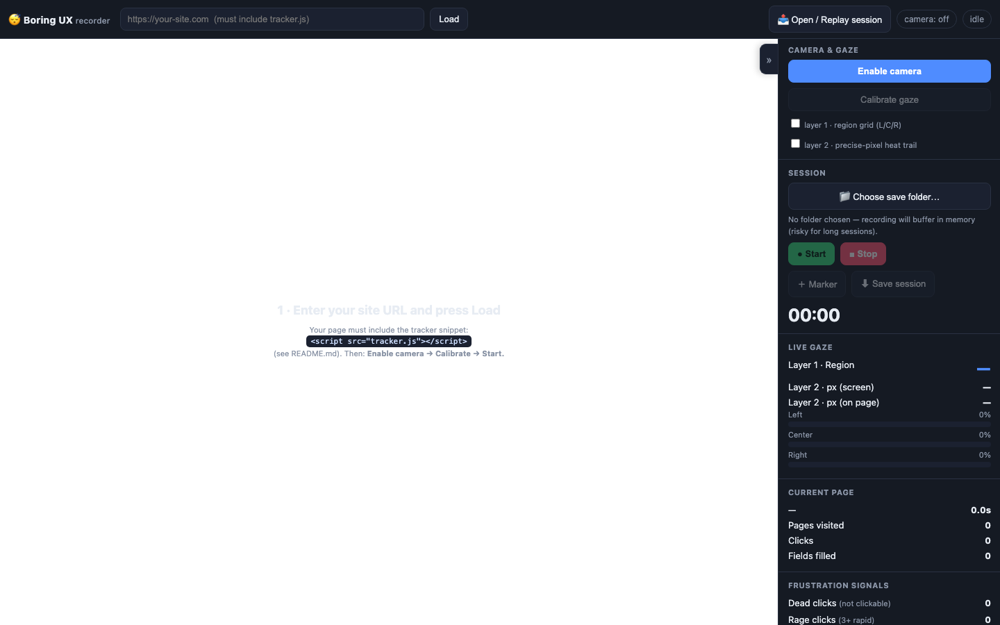
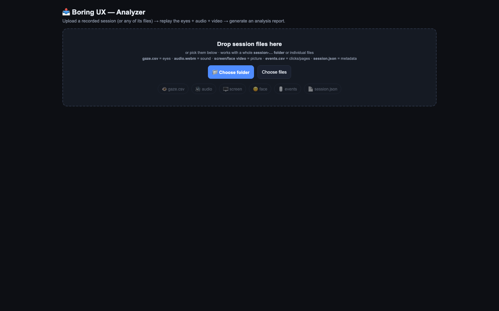
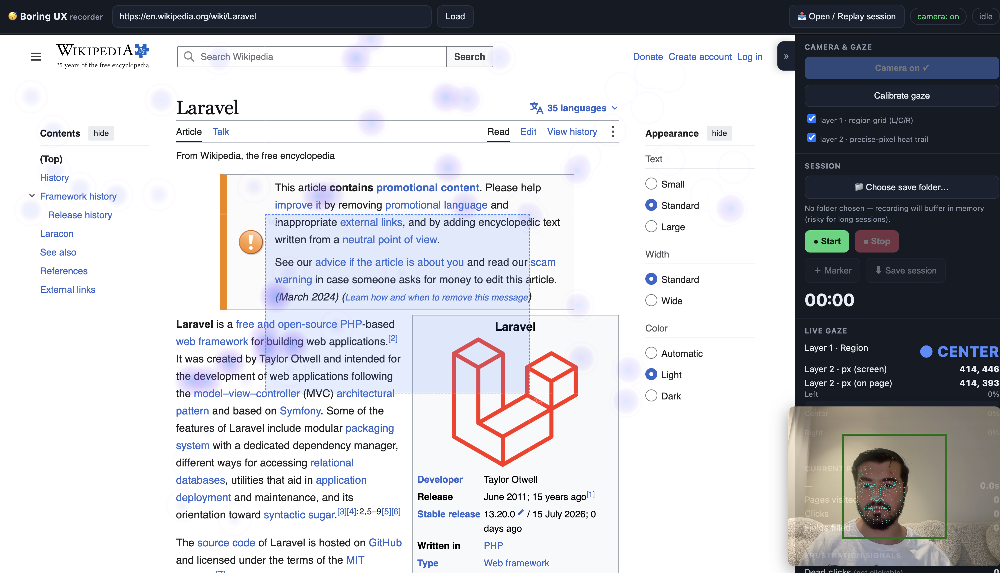
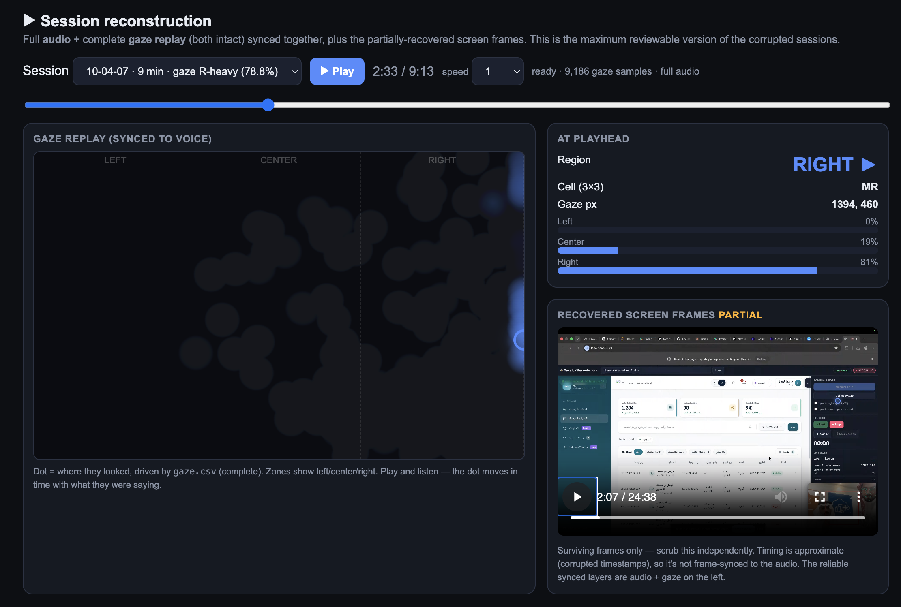

<h1 align="center">😴 Boring UX</h1>
<p align="center"><b>Open-source webcam eye-tracking usability lab.</b><br>
Record a session, watch exactly where people looked, and turn it into a UX report — no lab, no hardware, no SaaS, no data leaving the browser.</p>

<p align="center">


</p>

---

## Why "Boring UX"?

Great UX is **boring** — invisible, frictionless, nobody notices it. Bad UX is exciting: people hunt, hesitate, rage-click. **Boring UX finds the exciting parts so you can make them boring.** It watches a real user's **eyes, voice, screen, and clicks**, then shows you where attention went, where they got stuck, and what to fix.

Usability testing normally means a $30k eye-tracker or a per-seat SaaS. This does the 80% that matters with a **webcam and a browser** — and it's yours.

## What it does

- 🎥 **Records** screen + webcam face + mic audio, all **streamed straight to disk** (can't corrupt, even on long sessions).
- 👁 **Two gaze layers** — coarse **left / center / right** regions, and a **precise-pixel heat trail** — from the webcam via [WebGazer](https://webgazer.cs.brown.edu/).
- ⏱ **Auto-captures** per-page time, per-field fill-time, clicks, and **frustration signals**: dead clicks, rage clicks, scroll-thrash (via a one-line snippet on your own site).
- ▶️ **Replays** everything synced — the gaze dot moving on the left, audio, and the screen/face video — from an **upload page** (drag in a folder, watch it back).
- 📊 **Generates a report** — a quantitative analysis (gaze distribution, attention-over-time, 3×3 heatmap, fixations, timing, frustration) you can print to PDF.
- 🧠 **Ships an AI prompt** in every session folder — paste it into Claude/ChatGPT (or run Claude Code) to get a **full, evidence-based UX report** that fuses gaze + what they said + timing.

100% client-side. Your recordings never leave your machine.

## ▶️ See it in action

<p align="center">

<br><em>Live session — the gaze dot tracks the eyes over the site under test, with the two layers and frustration signals updating in real time.</em>
</p>

<p align="center">

<br><em>Replay + report — the eyes replay on the left synced to audio + video, then one click generates the analysis (heatmap, attention-over-time, timing, frustration).</em>
</p>

> 📸 **Maintainers:** drop your own captures at `screenshots/live-recording.png` and `screenshots/replay-report.png` and they'll appear here. (These two are best grabbed live — a headless browser can't run a real webcam or load a session.)

## Quick start

```bash
git clone <your-repo-url> boring-ux && cd boring-ux
python3 -m http.server 8000      # any static server works
```
Open **http://localhost:8000** in **Chrome**.

> A local server (or `file://`) is needed for camera + screen capture (a secure context). Chrome/Chromium/Edge recommended.

### Record a session
1. **📁 Choose save folder** — recordings stream here live (do this for any real session).
2. Enter your site's URL and **Load** it (your page must include the snippet — see below).
3. **Enable camera** → **Calibrate** (click the 5 dots) → **● Start**.
4. Let the participant do the task. **■ Stop** when done — everything is saved automatically.

### Instrument your site (one line)
To capture clicks, page-time, and frustration signals, add the snippet to the site you're testing:
```html
<script src="tracker.js"></script>
```
Gaze + audio + video work without it; **clicks/pages/field-times need it** (a browser can't see another site's clicks otherwise). No snippet, no site? Load the included **`demo-form.html`** to try the whole loop.

### Replay & analyze
Click **📤 Open / Replay session** (or open `analyze.html`) → drag your `session-…` folder in → press **Play** to watch the eyes + audio + video → **📊 Generate analysis report** → **🖨 Print / Save PDF**.

### Get the *full* AI report
Every saved session folder contains **`ANALYZE-PROMPT.md`**. Transcribe the audio (one local command, in the file), then paste the prompt + files into Claude or ChatGPT — you get a complete UX report: overall grade, attention graphs, feature-by-feature scorecard, intent heatmaps ("where do users look when confused vs. acting"), findings, a RICE backlog, and a full fused transcript appendix.

## What a session folder contains

| File | What it is |
|---|---|
| `screen.webm` | screen recording + voice |
| `face.webm` | webcam face + voice |
| `audio.webm` | audio only |
| `gaze.csv` | every gaze sample: `t_ms, screen/page x/y, region (L/C/R), cell (3×3)` |
| `events.csv` | pages, clicks (+ gaze region), field fill-times, dead/rage/scroll signals |
| `session.json` | duration, viewport, gaze distribution, signals |
| `ANALYZE-PROMPT.md` | the AI prompt to generate the full report |

## Honest limitations

- **Webcam gaze is region-accurate, not pixel-perfect** (~50–150px even after calibration). Great for left/center/right and heatmaps; not for telling two adjacent buttons apart. Hardware trackers exist for that.
- **Calibrate every session** — uncalibrated gaze drifts; the report flags it as directional.
- **Clicks need the snippet.** Mouse *movement* isn't captured yet (only clicks).
- The in-browser report is **quantitative**; the *spoken* analysis needs a transcription step (Whisper, one command — local & private).

## How it works

`index.html` (recorder) hosts your site in a frame, runs WebGazer on the webcam for the gaze layers, streams three `MediaRecorder` tracks to disk, and logs gaze + events on one clock. `tracker.js` on your site `postMessage`s clicks/pages/field-times back. `analyze.html` replays any uploaded session and generates the report. Everything is vanilla HTML/JS — no build step, no dependencies except WebGazer from CDN.

## Contributing

Issues and PRs welcome — ideas: continuous mouse-move capture, in-browser transcription (Whisper WASM), AOI (area-of-interest) tagging, multi-session aggregation, a hosted demo.

## License

[MIT](LICENSE) — do what you like, no warranty.
