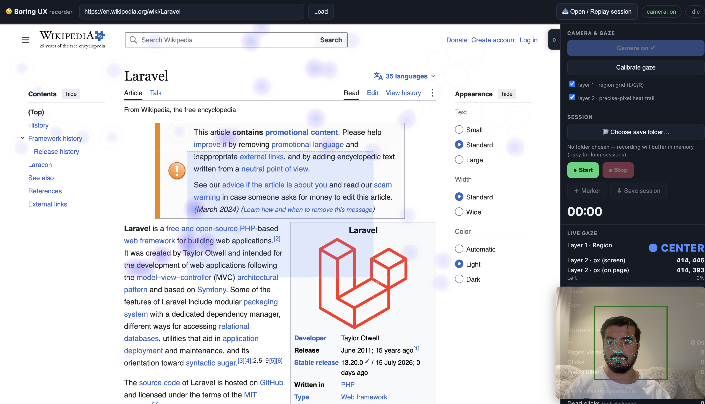
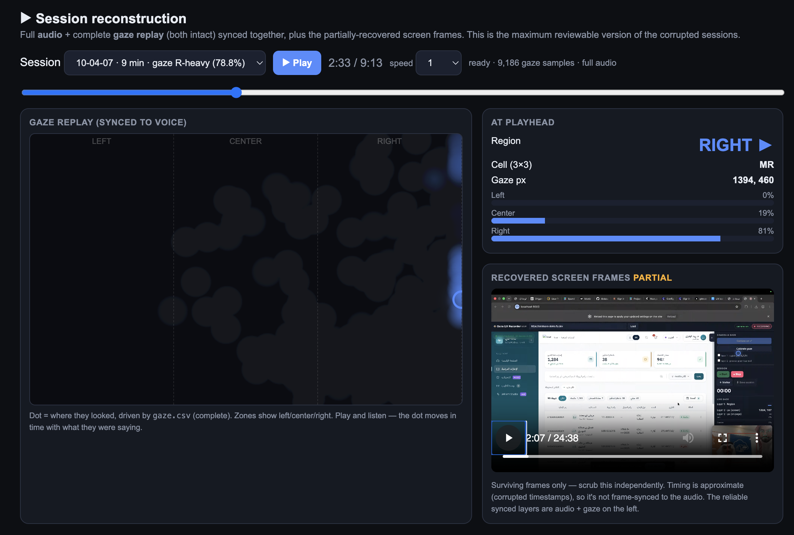

<h1 align="center">😴 Boring UX</h1>
<p align="center"><b>Open-source webcam eye-tracking usability lab.</b><br>
Record a session, watch exactly where people looked, and turn it into a UX report — no lab, no hardware, no SaaS, no data leaving the browser.</p>

<p align="center">

<br><em>Live session — the precise-pixel <b>heat trail</b> follows the eyes across the page, the WebGazer <b>face mesh</b> tracks the participant, and the panel shows region + frustration signals in real time.</em>
</p>

<p align="center">

<br><em>Replay any session — the <b>gaze replay</b> plays synced to audio + video, with live left/center/right, 3×3 cell, and pixel readouts at the playhead.</em>
</p>

---

## For product managers & designers

You shipped a new flow. Does it actually **work** — not "did QA pass," but does a real human's **eyes** land where you intended, or do they hunt, hesitate, and rage-click? Analytics tell you *what* people clicked. They never tell you **where attention went, what confused them, or why they gave up.** Boring UX does — in an afternoon, for free.

1. **Record** a real person using your new design, feature, or redesign — their **screen, voice (think-aloud), face, and exactly where their eyes go.**
2. **Watch it back** — see the gaze miss your new button, the moment confusion hits, the 90 seconds they stall on one form field.
3. **Get the report** — every finding tied to **what they said × where they looked × how long it took**, scored and turned into a **RICE-prioritized backlog** you drop straight into Jira/Linear.

The output isn't a dashboard — it's a **decision**: *"Users can't find 'New Leave' — 8-minute hunt, eyes drifting off-screen → move it top-right. P0."* Hand that to engineering on Monday.

> No \$30k eye-tracker. No SaaS seat. No recruiting agency. No data leaving your laptop. Just **proof of where attention goes** — the one thing you can't fake and can't measure any other way.

## Why "Boring UX"?

Great UX is **boring** — invisible, frictionless, nobody notices it. Bad UX is exciting: people hunt, hesitate, rage-click. **Boring UX finds the exciting parts so you can make them boring.** It watches a real user's **eyes, voice, screen, and clicks**, then shows you where attention went, where they got stuck, and what to fix.

Usability testing normally means a $30k eye-tracker or a per-seat SaaS. This does the 80% that matters with a **webcam and a browser** — and it's yours.

## What it does

- 🎥 **Records** screen + webcam face + mic audio, all **streamed straight to disk** (can't corrupt, even on long sessions).
- 👁 **Two gaze layers** — coarse **left / center / right** regions, and a **precise-pixel heat trail** — from the webcam via [WebGazer](https://webgazer.cs.brown.edu/).
- ⏱ **Auto-captures** per-page time, per-field fill-time, clicks, and **frustration signals**: dead clicks, rage clicks, scroll-thrash (via a one-line snippet on your own site).
- ▶️ **Replays** everything synced — the gaze dot moving on the left, audio, and the screen/face video — from an **upload page** (drag in a folder, watch it back).
- 📊 **Generates a report** — a quantitative analysis (gaze distribution, attention-over-time, 3×3 heatmap, fixations, timing, frustration) you can print to PDF.
- 🧠 **Ships an AI prompt** in every session folder — paste it into Claude/ChatGPT (or run Claude Code) to get a **full, evidence-based UX report** that fuses gaze + what they said + timing.

100% client-side. Your recordings never leave your machine.

## Quick start

```bash
git clone <your-repo-url> boring-ux && cd boring-ux
python3 -m http.server 8000      # any static server works
```
Open **http://localhost:8000** in **Chrome**.

> A local server (or `file://`) is needed for camera + screen capture (a secure context). Chrome/Chromium/Edge recommended.

### Record a session
1. **📁 Choose save folder** — recordings stream here live (do this for any real session).
2. Enter your site's URL and **Load** it (your page must include the snippet — see below).
3. **Enable camera** → **Calibrate** (13 dots + an automatic accuracy check — required) → **● Start**.
4. Let the participant do the task. **■ Stop** when done — everything is saved automatically.

### Instrument your site (one line)
To capture clicks, page-time, and frustration signals, add the snippet to the site you're testing:
```html
<script src="tracker.js"></script>
```
Gaze + audio + video work without it; **clicks/pages/field-times/mouse need it** (a browser can't see another site's clicks otherwise). No snippet, no site? Load the included **`demo-form.html`** to try the whole loop.

> **Two rules that make or break a session:**
> 1. **The tested site must stay inside the frame, and the recorder tab must stay in front.** Eye tracking runs in the recorder tab — Chrome pauses it the moment the tab goes to the background. The recorder now warns you live and marks the gap in the data. (`tracker.js` also rewrites `target="_blank"` links to stay in-frame.)
> 2. **Sites that show "refused to connect" block framing** (`X-Frame-Options`/CSP) and cannot be eye-tracked in any browser tool — test a staging build without that header.

### Replay & analyze
Click **📤 Open / Replay session** (or open `analyze.html`) → drag your `session-…` folder in → press **Play** to watch the eyes + audio + video → **📊 Generate analysis report** → **🖨 Print / Save PDF**.

### Get the *full* AI report
Every saved session folder contains **`SESSION-AI.md`** — a single agent-ready file with the session metadata, data-quality/accuracy notes, and a **unified timeline** merging gaze + mouse + clicks + pages on one clock — plus **`ANALYZE-PROMPT.md`** (the analysis instructions). Two ways to use them:

- **Paste into Claude / ChatGPT:** transcribe the audio (one local command, inside the file), then hand over `SESSION-AI.md` + the transcript.
- **Run the bundled skill:** the repo ships a Claude Code skill (`.claude/skills/boring-ux-report`) — open Claude Code in the repo and say *"analyze session-…"*, and it transcribes, fuses, and writes `report.html` + `report.pdf` into the session folder.

Either way you get the complete UX report: overall grade, attention graphs, feature-by-feature scorecard, intent heatmaps ("where do users look when confused vs. acting"), findings, a RICE backlog, and a full fused transcript appendix.

## 🧩 Test ANY website (browser extension)

The in-browser recorder only loads sites that allow framing. To eye-track **any site on the web** — including ones that send `X-Frame-Options` — use the bundled **browser extension**. It runs *inside the real page* (like Hotjar/FullStory), so there's no iframe, no header limits, accurate coordinates, and **no `tracker.js` needed** (it sees clicks/mouse natively).

**Install (Chrome/Edge, unpacked):**
1. `chrome://extensions` → toggle **Developer mode** on
2. **Load unpacked** → select the `extension/` folder
3. Go to any website → click the **Boring UX** toolbar icon → a panel appears
4. **Enable camera → Calibrate (13 dots + accuracy check) → Start** → do the task → **Stop & save**

It downloads a full `session-…/` (gaze.csv, mouse.csv, events.csv, session.json, **SESSION-AI.md**, face/audio/optional screen) — the same AI-ready bundle, from any site. ⚠ Keep the tab in front while recording (eye tracking pauses on hidden tabs; it warns you).

> Note: the extension weakens nothing on the visited site — it only reads gaze/interaction locally and saves to your machine. Removing a site's own security headers via proxies is **not** how this works, by design.

## What a session folder contains

| File | What it is |
|---|---|
| `screen.webm` | screen recording + voice |
| `face.webm` | webcam face + voice |
| `audio.webm` | audio only |
| `gaze.csv` | every gaze sample: `t_ms, screen/page x/y, region (L/C/R), cell (3×3)` |
| `mouse.csv` | continuous cursor path (~15 Hz) |
| `SESSION-AI.md` | **one agent-ready file**: metadata + accuracy + unified gaze/mouse/event timeline |
| `events.csv` | pages, clicks (+ gaze region), field fill-times, dead/rage/scroll signals |
| `session.json` | duration, viewport, gaze distribution, signals |
| `ANALYZE-PROMPT.md` | the AI prompt to generate the full report |

## Honest limitations

- **Webcam gaze is region-accurate, not pixel-perfect** (~50–150px). The recorder now fights this three ways: a required **13-point calibration**, a **validation pass that measures your real accuracy in px** (saved into `session.json` as `gazeAccuracyPx` so reports can weight the data), and **continuous recalibration from every in-page click** during the session. Still: great for regions and heatmaps, not for telling two adjacent buttons apart — hardware trackers exist for that.
- **Calibrate every session** — the recorder warns you before starting uncalibrated; the measured accuracy score tells you when to redo it (aim for <140px).
- **Clicks + mouse movement need the snippet** (`tracker.js`) on the tested site.
- The in-browser report is **quantitative**; the *spoken* analysis needs a transcription step (Whisper, one command — local & private).

## How it works

`index.html` (recorder) hosts your site in a frame, runs WebGazer on the webcam for the gaze layers, streams three `MediaRecorder` tracks to disk, and logs gaze + events on one clock. `tracker.js` on your site `postMessage`s clicks/pages/field-times back. `analyze.html` replays any uploaded session and generates the report. Everything is vanilla HTML/JS — no build step, no dependencies except WebGazer from CDN.

## Contributing

Issues and PRs welcome — ideas: continuous mouse-move capture, in-browser transcription (Whisper WASM), AOI (area-of-interest) tagging, multi-session aggregation, a hosted demo.

## License

[MIT](LICENSE) — do what you like, no warranty.
